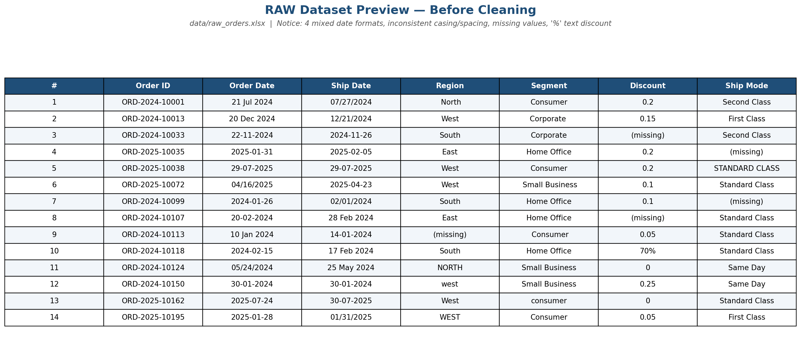
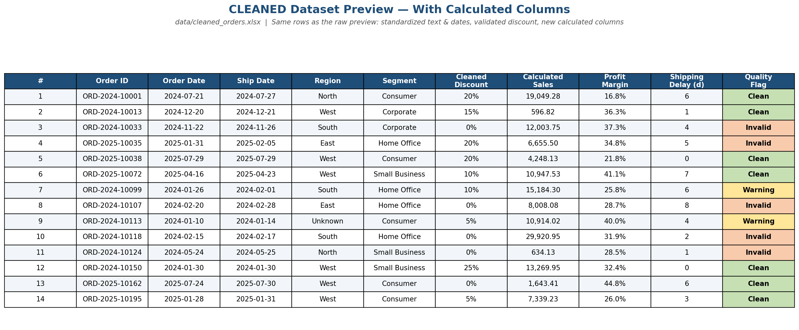
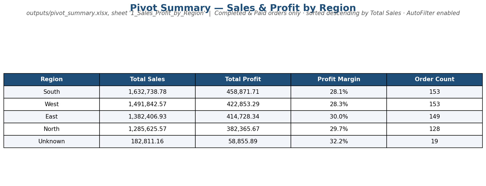
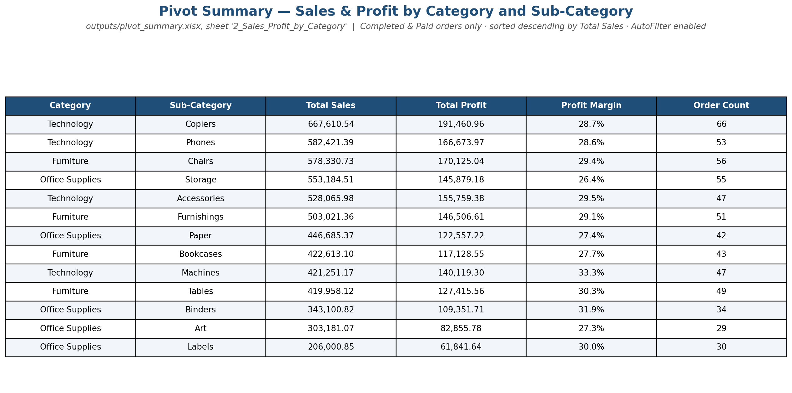

# Retail Order Data — Cleaning, Validation & Reporting

## 1. Problem Summary

The company exports order-level sales data from multiple internal systems. The raw export
contains inconsistent text formatting, mixed date formats, duplicate records, missing
values, invalid discounts, sales/profit calculation mismatches, and order-status
inconsistencies. This project cleans the data, validates it against a defined set of
business rules, documents every decision made, and produces analysis-ready reports for
business review.

## 2. Dataset Description

- **Source:** `data/raw_orders.xlsx`, sheet `raw_orders` — **932 order-level rows**, one row
  per order line.
- **Fields:** `order_id`, `order_date`, `ship_date`, `customer_id`, `customer_name`,
  `segment`, `region`, `state`, `city`, `category`, `sub_category`, `product_name`,
  `ship_mode`, `quantity`, `unit_price`, `discount`, `sales`, `cost`, `profit`,
  `payment_status`, `order_status`.
- **Output:** `data/cleaned_orders.xlsx` — **912 rows** (20 exact duplicates removed) with
  10 additional calculated/flag columns.

## 3. Tools Used

- **Python (pandas, numpy)** — date parsing, missing-value detection, duplicate
  identification; used to produce one canonical cleaned dataset that every output file
  is checked against.
- **openpyxl** — building all 3 deliverable workbooks, including live Excel formulas
  (`TRIM`, `SUBSTITUTE`, `PROPER`, `TEXTJOIN`, `COUNTIF`, `COUNTIFS`, `SUMIFS`,
  `AVERAGEIFS`, `IFERROR`), conditional formatting, AutoFilter, and tables.
- **LibreOffice headless (`recalc.py`)** — used to force a full formula recalculation of
  every workbook and confirm **zero formula errors** before delivery.
- **matplotlib** — rendering the 4 preview screenshots.

## 4. Cleaning Steps Performed

1. **Preserve the raw file** — `data/raw_orders.xlsx` is read-only throughout; verified
   byte-for-byte identical to the original export.
2. **Clean text fields** (`customer_name`, `segment`, `region`, `state`, `city`,
   `category`, `sub_category`, `ship_mode`, `payment_status`, `order_status`) — done with
   a live formula, not pre-baked values:
   `=PROPER(TRIM(SUBSTITUTE(<raw cell>,CHAR(160)," ")))`. The untouched raw text lives in
   the `Raw_Text_Fields` sheet of `cleaned_orders.xlsx` for full auditability.
3. **Clean and validate dates** — `order_date`/`ship_date` mixed 4 formats
   (`YYYY-MM-DD`, `MM/DD/YYYY`, `DD-MM-YYYY`, `DD Mon YYYY`) in the same column; parsed
   programmatically (not via Excel's locale-dependent auto-detection) and cross-checked
   against the year embedded in `order_id` with zero mismatches.
4. **Handle duplicates** — 20 exact duplicate rows removed (logged in
   `Removed_Duplicates_Log`); 24 rows across 12 `order_id`s with **conflicting** data were
   kept and flagged, never silently resolved.
5. **Apply business rules** — see section 5.
6. **Add calculated columns** — `cleaned_discount`, `calculated_sales`,
   `calculated_profit`, `profit_margin`, `shipping_delay_days`, `order_month`,
   `order_year`, `data_quality_flag` (Clean / Warning / Invalid), all as live formulas.
7. **Build reports** — `outputs/data_quality_report.xlsx` (7 summary sheets) and
   `outputs/pivot_summary.xlsx` (6 pivot-style summaries), each self-contained with their
   own embedded copy of the cleaned data so they compute correctly standalone.

## 5. Business Rules Applied

| Rule Area | Required Action | Applied As |
|---|---|---|
| Missing region | Fill Unknown, flag | Filled, flagged `Missing Region (filled Unknown)` |
| Missing ship_mode | Fill Unknown, flag | Filled, flagged `Missing Ship Mode (filled Unknown)` |
| Missing discount | 0 only if other sales fields valid | Defaulted to 0 (verified valid every time) |
| Negative discount | Flag invalid | Flagged `Invalid Discount (Negative)`, zeroed only in `cleaned_discount` |
| Discount above allowed range | Flag invalid | Range set 0%–50%; flagged `Invalid Discount (Too High)` |
| Cancelled orders | Exclude from completed-sales summary | Pivot sales/profit filtered to `order_status="Completed"` |
| Failed payments | Exclude from completed-sales summary | Pivots additionally filtered to `payment_status="Paid"` |
| Refunded orders | Summarize separately | Dedicated pivot sheet `5_Refunded_Cancelled_Failed` |
| Ship date before order date | Flag invalid shipping record | Flagged `Invalid Shipping Record (Ship Before Order)` |

Full reasoning for every decision is in `outputs/cleaning_log.md`.

## 6. Summary of Data Quality Issues Found

| Issue | Count |
|---|---|
| Exact duplicate rows | 20 (removed) |
| Conflicting duplicate order_ids | 12 ids / 24 rows (flagged, kept) |
| Missing region / ship_mode / discount | 25 / 21 / 18 |
| Invalid discount (negative / too high) | 15 / 15 |
| Ship date before order date | 21 |
| Sales mismatch / Profit mismatch | 54 / 54 |
| Missing or unrecognized dates | 0 |

**Final record status:** 756 Clean · 44 Warning · 112 Invalid (out of 912 rows) —
see `outputs/data_quality_report.xlsx`.

## 7. Summary of Final Pivot Reports

All in `outputs/pivot_summary.xlsx`:

1. **Sales & profit by region** — South leads on total sales (₹16.3L) but has the
   *lowest* profit margin (28.1%); Unknown region (missing data) has the highest margin
   (32.2%) on a small base.
2. **Sales & profit by category/sub-category** — Technology > Copiers is the top
   sub-category by sales; Technology > Machines has the best margin (33.3%) despite
   mid-table sales.
3. **Order count by ship mode** — fairly even split (22–27%) across First Class, Same
   Day, Second Class, Standard Class; 21 orders (2.3%) have an Unknown ship mode.
4. **Profit margin by segment** — Home Office has the best margin (29.9%); Small
   Business has the highest total sales but the lowest margin (28.2%).
5. **Refunded/cancelled/failed by region** — North has the most cancellations (48
   orders, ₹4.85L in lost sales) and the most refunds by value.
6. **Monthly sales trend** — visible seasonality, with Feb 2025 and May–Jun 2024 as
   peak months.

Sheets 1 and 2 are sorted descending by Total Sales and have AutoFilter enabled.

## 8. Key Business Insights

- **Sales volume and profitability don't move together.** South and Small Business
  generate the most revenue but convert it least efficiently; Home Office and the
  Technology > Machines line are smaller but more profitable per rupee of sales.
- **~12% of records need attention before being trusted in analysis** (`Invalid`
  flag) — mostly invalid discounts, ship-before-order dates, and sales/profit
  mismatches, concentrated enough to be worth a source-system investigation rather
  than one-off fixes.
- **Cancellations are not evenly distributed** — North has nearly double the
  cancellation rate of Unknown/West, which may warrant a regional process review.

## 9. Assumptions and Limitations

- "Completed sales" = `order_status="Completed"` **AND** `payment_status="Paid"`.
- Allowed discount range assumed at 0%–50% (not stated explicitly in the source rules).
- Calculation-mismatch tolerance set at ±1 currency unit (rounding noise).
- Conflicting duplicate order_ids were **flagged, not resolved** — no reliable way to
  pick the "correct" copy without checking the source system.
- 42 `customer_id`s map to more than one `customer_name`; observed but not corrected, as
  it isn't covered by the stated business rules.
- `data_quality_report.xlsx` and `pivot_summary.xlsx` each embed their own copy of the
  cleaned data rather than linking live to `cleaned_orders.xlsx`, since cross-file Excel
  references are fragile when a project folder is shared or moved. All three files are
  generated from the same cleaning run, so the numbers agree.
- Pivot summaries are SUMIFS/COUNTIFS-based tables, not native interactive Excel
  PivotTable objects (a known `openpyxl` limitation) — analytically equivalent, and the
  embedded `Data` sheet in `pivot_summary.xlsx` can be used to build a true PivotTable
  manually if needed.

Full detail in `outputs/cleaning_log.md`.

## 10. Screenshots

**Raw data before cleaning** — note the 4 different date formats, inconsistent casing
(`NORTH` / `west` / `WEST`), and the `'70%'` text discount:

**Cleaned data with calculated columns** — same rows, now standardized, with
`cleaned_discount`, `calculated_sales`, `profit_margin`, `shipping_delay_days`, and the
color-coded `data_quality_flag`:

**Pivot summary — Sales & profit by region:**

**Pivot summary — Sales & profit by category and sub-category:**

---

